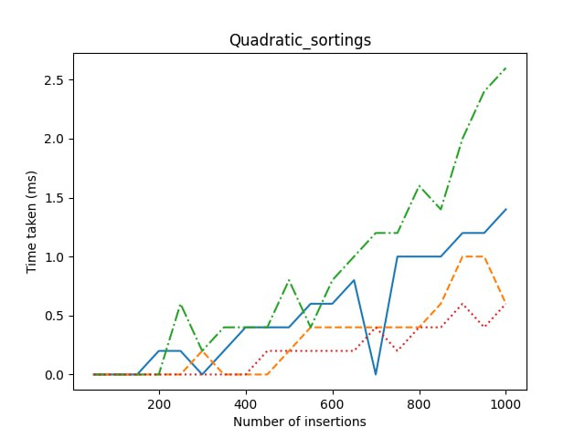
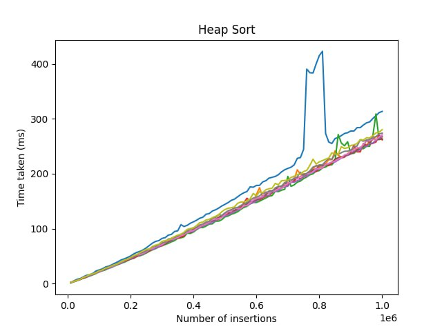
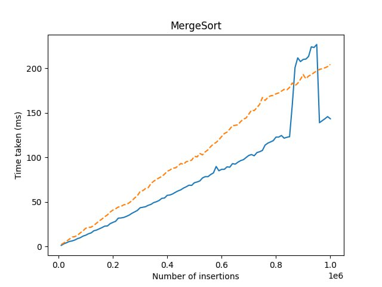
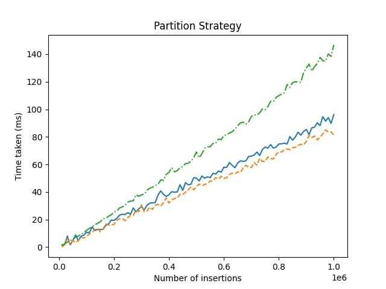
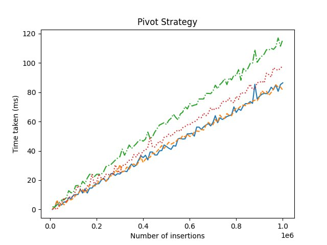
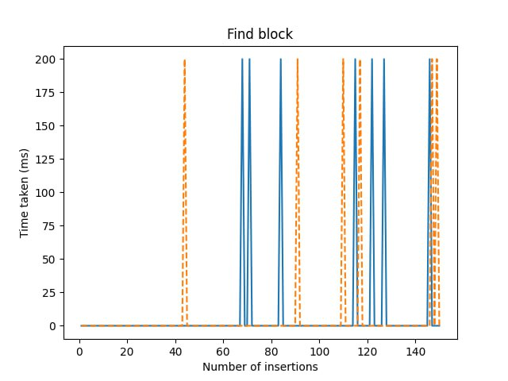
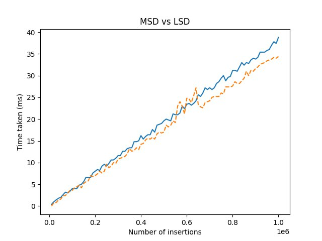

<h1 align="center"> Lab 3 </h1>
<h3 laign="center"> Пункт 1 </h3>

<h3> Вывод: сортировка Шелла самая крутая</h3>
<h3 laign="center"> Пункт 2 </h3>

<h3> Вывод: сортировка на 5-чной куче работает лучше всего</h3>
<h3 laign="center"> Пункт 3 </h3>

<h3> Вывод: Рекурсивно быстрее</h3>
<h3 laign="center"> Пункт 4 </h3>

<h3> Вывод: Хоара лучше Ломута и немного лучше толстого разбиения, в основном из-за специфики данных тестов</h3>
<h3 laign="center"> Пункт 5 </h3>

<h3> Вывод: из-за рандомности тестов средний элемент показывает себя лучше всего, тк имеет самое маленькое время выполнения</h3>
<h3 laign="center"> Пункт 6 </h3>

<h3> Вывод: мой компьютер вычисляет время с точностью до 0.2 мс</h3>
<h3 laign="center"> Пункт 8 </h3>

<h3> Вывод: LSD топ (да не наркоман я)</h3>
