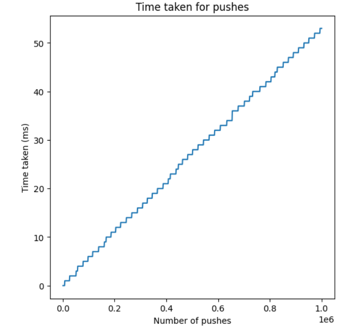

<h1 align="center"> Lab 2 </h1>
<table border="1">
<tr><td> </td><td>Test1</td><tdTest2<td>Test3</td></tr>
<tr><td>SLL</td><td>137.6 ms</td><td>251.6 ms</td><td>51.2 ms</td></tr>
<tr><td>Vector</td><td>15 ms</td><td>29.4 ms</td><td>19 ms</td></tr>
</table>
<h3 laign="center"> Test4 </h3>
